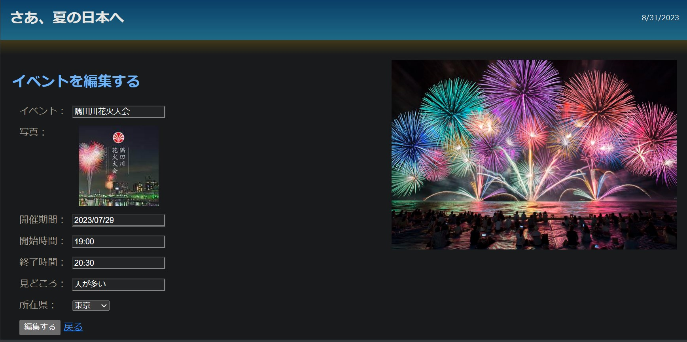

# イベント情報サイト
このプロジェクトは、日本全国の花火大会などのイベント情報をまとめて表示するWebアプリケーションです。ユーザーは都道府県ごとにイベントを閲覧し、イベントの追加・編集・削除が可能です。

## サイトイメージ
**サインアップ画面**

**都道府県の一覧**

**イベントの一覧**

**イベントの編集**

## 機能
- ユーザー認証: ユーザーはアカウントを登録し、ログイン・ログアウトができます。ログインしていない場合はページを閲覧できず、自動的にログイン画面に戻ります。
- 都道府県ごとのイベント一覧: 選択した都道府県のイベントを一覧で閲覧できます。
- イベント詳細: イベントの詳細情報を表示し、日時、場所、説明などを確認できます。
- 都道府県&イベントの追加・編集・削除: 管理者ユーザーは新しいイベントを追加し、既存のイベント情報を編集・削除できます。

## 使用技術
- Spring Boot
- MyBatis
- MySQL
- Lombok
- Redis: 認証コードやセッション管理に使用。
- Vue.js
- Maven

